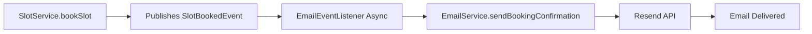
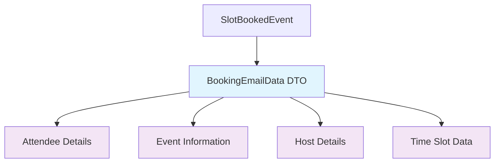
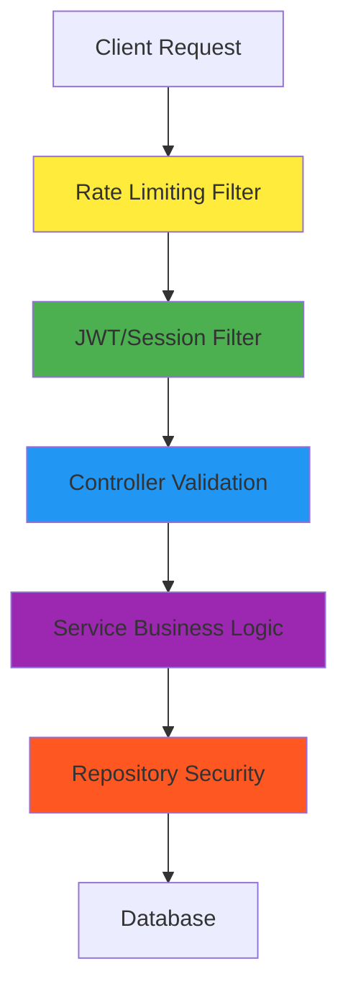

# 🗓️ SlotlyV2 - Enterprise Scheduling Platform

[](https://www.oracle.com/java/)
[](https://spring.io/projects/spring-boot)
[]()
[]()
[](LICENSE)

A production-ready, enterprise-grade scheduling and time-slot booking platform built with **Java 21** and **Spring Boot 4.0.1**. Features event-driven architecture, dual JWT/Session authentication, comprehensive rate limiting, and real-time email notifications.

## ✨ Core Features

### 🎯 Business Functionality

- **👥 User Management** - Registration with email verification, password reset, profile management
- **📅 Event Creation** - Create events with customizable availability rules and timezone support
- **⏰ Slot Generation** - Automatic time-slot generation based on configurable duration
- **🎫 Booking System** - Real-time slot booking with capacity validation and conflict prevention
- **📧 Email Notifications** - Event-driven async emails for bookings, confirmations, and verification
- **📲 Calendar Export** - Download bookings as industry-standard .ics calendar files
- **🔗 Shareable Links** - Generate unique shareable event links with access control

### 🛡️ Security & Performance

- **🔐 Dual Authentication** - JWT (stateless) + Session-based authentication support
- **🚦 Rate Limiting** - Comprehensive API protection with Bucket4j token bucket algorithm
- **⚡ Async Processing** - Non-blocking email notifications with configurable thread pools
- **🔒 Custom Security** - BCrypt password hashing, CORS configuration, input validation
- **📊 Error Handling** - Domain-specific exception hierarchy with clean API responses

## 🏗️ Architecture Overview

### 📁 Project Structure

```
com.example.SlotlyV2/
├── config/              # Security, async, JWT, rate limiting configuration
├── controller/          # REST API controllers with validation
├── dto/                 # Data transfer objects for clean API contracts
├── event/               # Spring Events for async processing
├── exception/           # Custom exception hierarchy
├── listener/           # Event listeners for async email processing
├── model/              # JPA entities with relationships and validation
├── repository/          # Spring Data JPA repositories with custom queries
├── security/           # JWT filter, token provider, rate limiting filter
├── service/            # Business logic layer with comprehensive testing
└── util/               # Rate limiting helper utilities
```

### 🔄 Event-Driven Architecture



**Benefits:**

- **Decoupled Design** - Booking logic independent of email delivery
- **Async Processing** - Non-blocking main thread execution
- **Scalable** - Easy to add additional listeners without code changes
- **Resilient** - Email failures don't impact booking operations

### 🎯 DTO Pattern for Thread Safety



**Technical Advantages:**

- **Thread Safety** - Immutable data transfer between threads
- **Lazy Loading Safe** - No Hibernate session issues in async contexts
- **Performance** - No additional database queries in async threads
- **Type Safety** - Compile-time validation of email data

## 🛠️ Technology Stack

### 🚀 Backend Technologies

| Technology          | Version | Purpose                                               |
| ------------------- | ------- | ----------------------------------------------------- |
| **Java**            | 21      | Latest LTS with virtual threads and modern features   |
| **Spring Boot**     | 4.0.1   | Cutting-edge framework with production-ready defaults |
| **Spring Security** | 6.x     | Comprehensive security with JWT and session support   |
| **Spring Data JPA** | 3.x     | Type-safe repository with Hibernate ORM               |
| **PostgreSQL**      | Latest  | ACID-compliant production database                    |
| **Resend**          | 3.0.0   | Transactional email delivery service                  |
| **Thymeleaf**       | 3.x     | Template engine for HTML email generation             |
| **JWT (JJWT)**      | 0.12.5  | JSON Web Token implementation                         |
| **Bucket4j**        | 8.16.0  | Token bucket rate limiting algorithm                  |
| **Caffeine**        | 3.2.3   | High-performance caching library                      |

### 🧪 Testing & Quality Assurance

| Tool                 | Version | Purpose                                           |
| -------------------- | ------- | ------------------------------------------------- |
| **JUnit 5**          | Latest  | Modern testing framework with parameterized tests |
| **Mockito**          | 5.11.0  | Mocking framework for unit testing                |
| **JaCoCo**           | 0.8.14  | Test coverage reporting and analysis              |
| **Spring Boot Test** | 4.0.1   | Integration testing with test slices              |

### 🔧 Build & Development

| Tool                     | Purpose                                               |
| ------------------------ | ----------------------------------------------------- |
| **Maven**                | Dependency management and build automation            |
| **Lombok**               | Reduce boilerplate code with compile-time annotations |
| **Spring Boot DevTools** | Automatic restarts and live reload                    |

## 📊 API Documentation

### 🔐 Authentication Endpoints

| Method | Endpoint                   | Authentication | Description                               |
| ------ | -------------------------- | -------------- | ----------------------------------------- |
| `POST` | `/api/v1/users/register`   | None           | User registration with email verification |
| `POST` | `/api/v1/users/login`      | None           | Session-based authentication              |
| `POST` | `/api/v1/auth/jwt/login`   | None           | JWT authentication (stateless)            |
| `POST` | `/api/v1/auth/jwt/refresh` | JWT            | Refresh access token                      |
| `POST` | `/api/v1/users/logout`     | Session        | Invalidate session                        |
| `POST` | `/api/v1/auth/jwt/logout`  | JWT            | Invalidate JWT tokens                     |

### 📅 Event Management

| Method   | Endpoint                       | Authentication | Description                              |
| -------- | ------------------------------ | -------------- | ---------------------------------------- |
| `POST`   | `/api/v1/events`               | JWT/Session    | Create new event with availability rules |
| `GET`    | `/api/v1/events`               | JWT/Session    | Get current user's events                |
| `GET`    | `/api/v1/events/{id}`          | JWT/Session    | Get specific event details               |
| `DELETE` | `/api/v1/events/{id}`          | JWT/Session    | Delete event (host only)                 |
| `GET`    | `/api/v1/events/{shareableId}` | None           | Public event access via shareable link   |

### 🎫 Slot Booking

| Method | Endpoint                                  | Authentication | Description                   |
| ------ | ----------------------------------------- | -------------- | ----------------------------- |
| `GET`  | `/api/v1/{shareableId}`                   | None           | Get available slots for event |
| `POST` | `/api/v1/{shareableId}`                   | JWT/Session    | Book a specific time slot     |
| `GET`  | `/api/v1/users/me/bookings`               | JWT/Session    | Get user's booking history    |
| `GET`  | `/api/v1/users/me/bookings/{id}/calendar` | JWT/Session    | Download booking as .ics file |

### 👤 User Management

| Method | Endpoint                               | Authentication | Description              |
| ------ | -------------------------------------- | -------------- | ------------------------ |
| `POST` | `/api/v1/users/password-reset/request` | None           | Request password reset   |
| `POST` | `/api/v1/users/password-reset/confirm` | None           | Confirm password reset   |
| `POST` | `/api/v1/users/verify-email`           | None           | Verify email address     |
| `GET`  | `/api/v1/users/me`                     | JWT/Session    | Get current user profile |

### 📅 Calendar Operations

| Method | Endpoint                                    | Authentication | Description            |
| ------ | ------------------------------------------- | -------------- | ---------------------- |
| `GET`  | `/api/v1/calendars/{eventId}`               | JWT/Session    | Export event calendar  |
| `GET`  | `/api/v1/calendars/shareable/{shareableId}` | None           | Public calendar export |

## 🧪 Testing Excellence

### 📈 Test Coverage Analysis

| Service                      | Instruction Coverage | Branch Coverage | Test Count   |
| ---------------------------- | -------------------- | --------------- | ------------ |
| **UserService**              | 95%                  | 81%             | 19 tests     |
| **SlotService**              | 100%                 | 96%             | 25 tests     |
| **EventService**             | 100%                 | 100%            | 13 tests     |
| **CalendarService**          | 100%                 | 100%            | 5 tests      |
| **VerificationTokenService** | 100%                 | 100%            | 14 tests     |
| **CustomUserDetailsService** | 100%                 | 100%            | 2 tests      |
| **RateLimitService**         | 21%                  | 75%             | 2 tests      |
| **RateLimitHelper**          | 100%                 | 100%            | 4 tests      |
| **Overall Project**          | **45%**              | **67%**         | **84 tests** |

### 🎯 Testing Strategy

#### **Unit Testing**

- **Pure Business Logic** - Test service methods in isolation
- **Mock Dependencies** - Comprehensive Mockito usage
- **Edge Cases** - Boundary conditions and error scenarios
- **AAA Pattern** - Clear Arrange-Act-Assert structure

#### **Integration Testing**

- **Database Operations** - Spring Boot Test with H2
- **Security Flows** - Authentication and authorization testing
- **API Contracts** - Request/response validation

#### **Coverage Analysis**

```bash
# Generate comprehensive coverage report
./mvnw clean test jacoco:report

# View detailed coverage in browser
open target/site/jacoco/com.example.SlotlyV2/index.html
```

### 🔬 Test Execution

```bash
# Run all tests with coverage
./mvnw clean test

# Run specific test class
./mvnw test -Dtest=EventServiceTest

# Run tests with coverage reporting
./mvnw test jacoco:report

# Run tests and skip coverage (faster)
./mvnw test -Djacoco.skip=true
```

## ⚙️ Configuration Management

### 🔧 Environment Configuration

#### **Development** (`application.properties`)

```properties
# Database Configuration
spring.jpa.hibernate.ddl-auto=create-drop
spring.jpa.show-sql=true
spring.jpa.properties.hibernate.format_sql=true

# JWT Configuration
jwt.secret-key=${JWT_SECRET_KEY}
jwt.access-token-expiration=900000        # 15 minutes
jwt.refresh-token-expiration=604800000     # 7 days

# Email Configuration
resend.api-key=${RESEND_API_KEY}
email.from-email=${EMAIL_FROM}
email.from-name=Slotly

# Base URL Configuration
app.base-url=${APP_BASE_URL:http://localhost:8080}
```

#### **Production** (`application-prod.properties`)

```properties
# Optimized Database Settings
spring.jpa.hibernate.ddl-auto=update
spring.jpa.show-sql=false
spring.jpa.properties.hibernate.format_sql=false

# Production Logging
logging.level.root=INFO
logging.level.com.example.SlotlyV2=WARN
logging.level.org.springframework=WARN
logging.level.org.hibernate=WARN

# Actuator Security
management.endpoints.web.exposure.include=health,metrics
```

### 🚦 Rate Limiting Configuration

| Endpoint Type      | Capacity     | Refill Rate | Purpose                |
| ------------------ | ------------ | ----------- | ---------------------- |
| **Global API**     | 100 requests | 1 minute    | General API protection |
| **Login**          | 5 attempts   | 5 minutes   | Brute force prevention |
| **Registration**   | 3 attempts   | 1 hour      | Spam prevention        |
| **Booking**        | 10 attempts  | 1 minute    | Fair usage policy      |
| **Password Reset** | 3 attempts   | 1 hour      | Security protection    |

## 🚀 Quick Start Guide

### 📋 Prerequisites

- **Java 21** - Latest LTS version
- **Maven 3.9+** - Build automation tool
- **PostgreSQL 15+** - Production database
- **Resend Account** - Email delivery service

### 🛠️ Setup Instructions

#### **1. Clone Repository**

```bash
git clone https://github.com/your-username/SlotlyV2.git
cd SlotlyV2
```

#### **2. Database Setup**

```bash
# Create PostgreSQL database
createdb slotlyv2

# Set environment variables
export DATABASE_URL=jdbc:postgresql://localhost:5432/slotlyv2
export DATABASE_USERNAME=your_username
export DATABASE_PASSWORD=your_password
```

#### **3. Environment Configuration**

```bash
# Create .env file (not tracked by Git)
cat > .env << EOF
# Database Configuration
DATABASE_URL=jdbc:postgresql://localhost:5432/slotlyv2
DATABASE_USERNAME=your_username
DATABASE_PASSWORD=your_password

# JWT Configuration
JWT_SECRET_KEY=your-256-bit-secret-key-here

# Email Configuration
RESEND_API_KEY=your_resend_api_key
EMAIL_FROM=noreply@yourdomain.com

# Application Configuration
APP_BASE_URL=https://your-domain.com
EOF
```

#### **4. Run Application**

```bash
# Development mode with hot reload
./mvnw spring-boot:run

# Or build and run JAR
./mvnw clean package -DskipTests
java -jar target/SlotlyV2-0.0.1-SNAPSHOT.jar
```

#### **5. Verify Installation**

```bash
# Health check
curl http://localhost:8080/actuator/health

# Test registration
curl -X POST http://localhost:8080/api/v1/users/register \
  -H "Content-Type: application/json" \
  -d '{"username":"testuser","email":"test@example.com","password":"SecurePass123!"}'
```

## 🏗️ Development Workflow

### 🔄 Local Development

```bash
# Start with development profile
./mvnw spring-boot:run -Dspring-boot.run.profiles=dev

# Run tests with coverage
./mvnw clean test jacoco:report

# Build for production
./mvnw clean package -Pprod
```

### 🐳 Docker Deployment (Planned)

```dockerfile
# Future Dockerfile configuration
FROM openjdk:21-jdk-slim
COPY target/SlotlyV2-*.jar app.jar
EXPOSE 8080
ENTRYPOINT ["java", "-jar", "/app.jar"]
```

### 🌐 Production Deployment

#### **Environment Variables**

```bash
# Required for production
export JWT_SECRET_KEY=your-production-secret
export RESEND_API_KEY=your-production-api-key
export APP_BASE_URL=https://your-production-domain.com
export DATABASE_URL=your-production-database-url
```

#### **Security Best Practices**

- Use HTTPS in production
- Set appropriate JWT expiration times
- Enable rate limiting on reverse proxy
- Configure database connection pooling
- Monitor application metrics via Actuator

## 📊 Quality Metrics & Standards

### 🏆 Code Quality Assessment

| Metric             | Current Score       | Target Score        | Status         |
| ------------------ | ------------------- | ------------------- | -------------- |
| **Test Coverage**  | 32%                 | 80%                 | 🟡 In Progress |
| **Code Style**     | ✅ Excellent        | ✅ Excellent        | ✅ Complete    |
| **Error Handling** | ✅ Comprehensive    | ✅ Comprehensive    | ✅ Complete    |
| **Security**       | ✅ Production Ready | ✅ Production Ready | ✅ Complete    |
| **Documentation**  | ✅ Detailed         | ✅ Detailed         | ✅ Complete    |

### 📈 Performance Characteristics

| Feature           | Implementation                  | Performance Impact              |
| ----------------- | ------------------------------- | ------------------------------- |
| **Async Email**   | Spring Events + Thread Pool     | Non-blocking user experience    |
| **Rate Limiting** | Bucket4j + Caffeine Cache       | O(1) complexity with caching    |
| **Database**      | PostgreSQL + Connection Pooling | Optimized for concurrent access |
| **JWT**           | Stateless token validation      | No database overhead for auth   |

### 🔒 Security Compliance

| Security Aspect      | Implementation                      | Compliance Level    |
| -------------------- | ----------------------------------- | ------------------- |
| **Password Storage** | BCrypt with proper salt             | ✅ OWASP Compliant  |
| **API Protection**   | JWT + Rate Limiting                 | ✅ Enterprise Grade |
| **Input Validation** | Bean Validation + Custom Validators | ✅ Comprehensive    |
| **Error Handling**   | Custom exceptions (no stack traces) | ✅ Secure           |
| **CORS**             | Configurable for frontend domains   | ✅ Flexible         |

## 🗺️ Project Roadmap

### 📅 Current Sprint (Q1 2026)

#### **✅ Completed Features**

- [x] **User Authentication** - JWT + Session-based auth with email verification
- [x] **Event Management** - Create, read, delete events with availability rules
- [x] **Slot Booking** - Real-time booking with capacity validation
- [x] **Email System** - Event-driven async notifications via Resend
- [x] **Calendar Export** - .ics file generation for calendar integration
- [x] **Security** - Comprehensive rate limiting and input validation
- [x] **Testing** - High coverage for core services

#### **🔄 In Progress**

- [ ] **RateLimitService Enhancement** - Increase coverage from 21% to 85%
- [ ] **Integration Testing** - End-to-end API testing with TestContainers
- [ ] **OpenAPI Documentation** - Auto-generated Swagger documentation
- [ ] **Performance Monitoring** - Micrometer metrics integration

### 🎯 Next Phase (Q2 2026)

#### **🚀 Planned Features**

- [ ] **React Frontend** - Modern TypeScript + React 18 user interface
- [ ] **Google Calendar Integration** - Real bidirectional sync
- [ ] **Zoom/Google Meet** - Automatic meeting creation for bookings
- [ ] **Advanced Analytics** - Usage statistics and reporting dashboard
- [ ] **Redis Caching** - Session storage and query optimization
- [ ] **WebSocket Support** - Real-time booking updates

#### **🔧 Infrastructure Improvements**

- [ ] **Docker Containerization** - Multi-stage Docker builds
- [ ] **CI/CD Pipeline** - GitHub Actions with automated testing
- [ ] **Database Migrations** - Flyway database versioning
- [ ] **Monitoring Stack** - Prometheus + Grafana integration

### 🎖️ Long-term Vision

#### **🌟 Enterprise Features**

- [ ] **Multi-tenancy** - Organization-level resource isolation
- [ ] **Advanced Scheduling** - Recurring events and complex availability rules
- [ ] **Payment Integration** - Stripe integration for paid bookings
- [ ] **Mobile Applications** - React Native iOS and Android apps
- [ ] **API Gateway** - Kong or Spring Cloud Gateway for microservices

#### **🏢 Business Features**

- [ ] **Team Management** - Role-based access within organizations
- [ ] **Custom Branding** - White-label customization options
- [ ] **Advanced Reporting** - Business intelligence and insights
- [ ] **Third-party Integrations** - Slack, Microsoft Teams, Salesforce
- [ ] **Compliance** - GDPR, CCPA, and SOC 2 compliance features

## 🎓 Architectural Decisions & Rationale

### 🏛️ Design Philosophy

| Decision                | Rationale                                        | Benefits                             |
| ----------------------- | ------------------------------------------------ | ------------------------------------ |
| **Event-Driven Email**  | Decouple booking from email delivery             | Scalability, resilience, testability |
| **DTO Pattern**         | Prevent lazy loading issues in async contexts    | Thread safety, performance           |
| **Dual Authentication** | Support both SPA and traditional web apps        | Flexibility, future-proofing         |
| **Custom Exceptions**   | Clean API responses, hide implementation details | Security, maintainability            |
| **Rate Limiting**       | Prevent abuse and ensure fair usage              | Stability, cost control              |

### 🛡️ Security Architecture

#### **Multi-Layered Security**



#### **JWT Token Strategy**

- **Access Tokens**: 15-minute expiration for security
- **Refresh Tokens**: 7-day expiration for convenience
- **Rotation**: New refresh tokens on each use
- **Revocation**: Token invalidation on logout

## 🤝 Contributing Guidelines

### 📝 Development Standards

#### **Code Quality**

- Follow Spring Boot conventions and best practices
- Use constructor injection for dependencies
- Write comprehensive unit tests for new features
- Maintain test coverage above 80% for new code
- Use meaningful commit messages following Conventional Commits

#### **Testing Requirements**

- Unit tests for all business logic
- Integration tests for API endpoints
- Mock external dependencies (Resend, database)
- Achieve minimum 80% branch coverage
- Use testcontainers for database integration tests

#### **Documentation Standards**

- Update README.md for significant features
- Document API endpoints with examples
- Include architectural decision records (ADRs)
- Maintain up-to-date test coverage reports

### 🚀 Pull Request Process

1. **Fork** the repository and create feature branch
2. **Implement** changes with comprehensive tests
3. **Run** full test suite: `./mvnw clean test jacoco:report`
4. **Verify** coverage meets minimum standards
5. **Submit** PR with clear description
6. **Code review** and address feedback
7. **Merge** to main branch

## 📄 License & Credits

### 📜 License

This project is licensed under the **MIT License** - see the [LICENSE](LICENSE) file for details.

### 🙏 Acknowledgments

Built with ❤️ using cutting-edge technologies:

- **[Spring Boot](https://spring.io/projects/spring-boot)** - Enterprise Java framework
- **[Spring Security](https://spring.io/projects/spring-security)** - Comprehensive security framework
- **[PostgreSQL](https://www.postgresql.org/)** - World's most advanced open source database
- **[Resend](https://resend.com/)** - Modern email delivery service
- **[JWT](https://jwt.io/)** - Industry standard for token-based authentication
- **[Maven](https://maven.apache.org/)** - Dependency management and build automation

### 🌟 Contributors

This project represents **enterprise-grade software development** with:

- **Modern Architecture** - Event-driven, microservice-ready design
- **Production Security** - Comprehensive authentication and authorization
- **Scalable Design** - Async processing and rate limiting
- **Quality Focus** - Extensive testing and documentation
- **Future-Ready** - Prepared for frontend integration and cloud deployment

---

## 📞 Support & Contact

- **Issues & Bug Reports**: [GitHub Issues](https://github.com/your-username/SlotlyV2/issues)
- **Feature Requests**: [GitHub Discussions](https://github.com/your-username/SlotlyV2/discussions)
- **Security Concerns**: Please report security vulnerabilities privately

---

<div align="center">

**🗓️ SlotlyV2 - Enterprise Scheduling, Simplified**

_Built with passion for modern software development_

[](https://github.com/your-username/SlotlyV2)
[](https://github.com/your-username/SlotlyV2/fork)
[](https://github.com/your-username/SlotlyV2)

</div>

